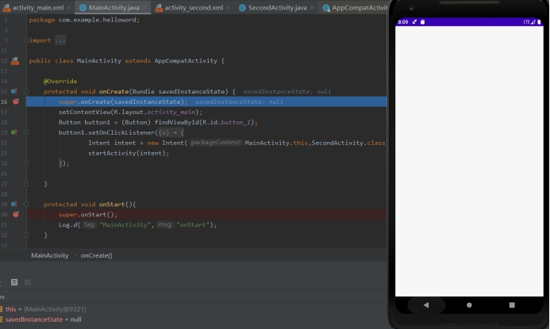
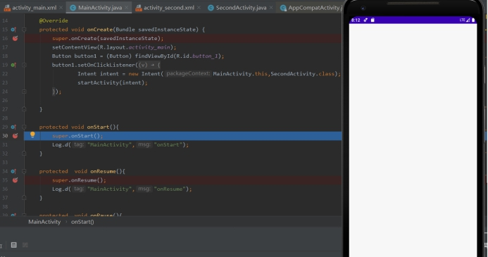
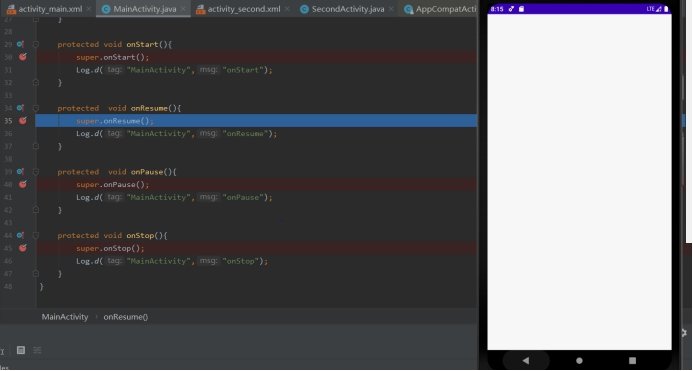
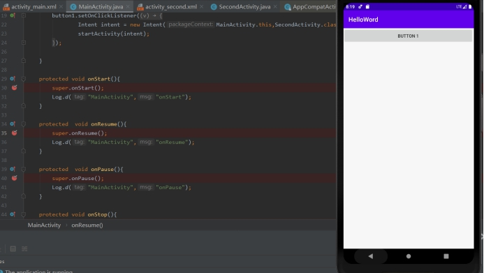
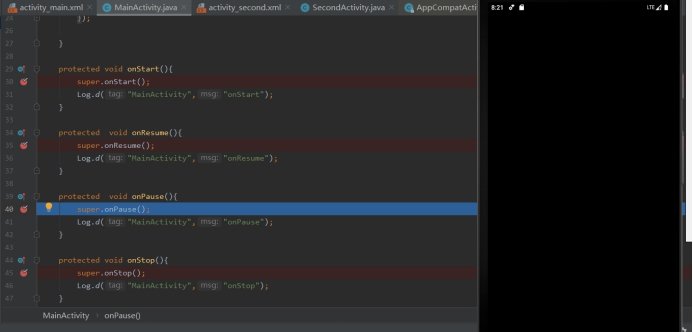
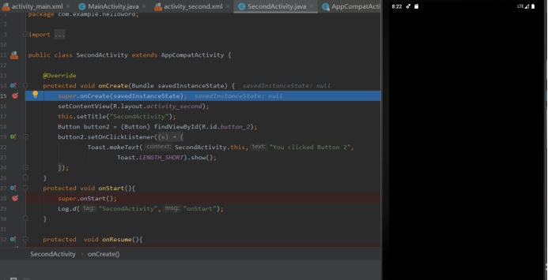
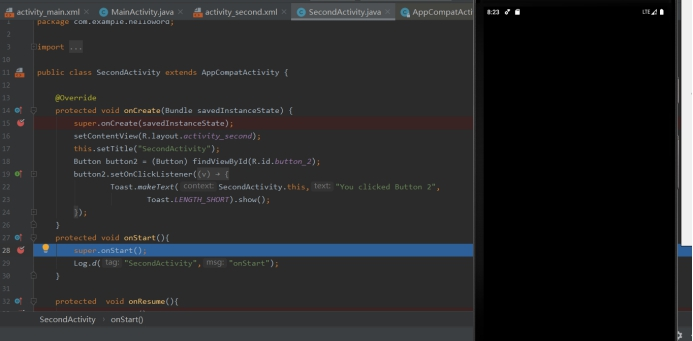
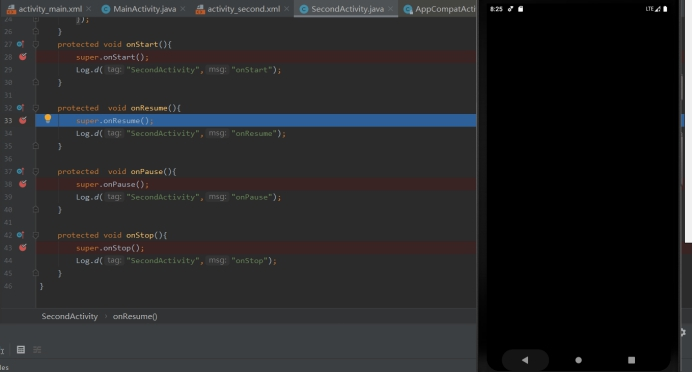
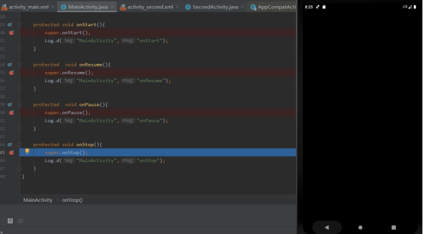
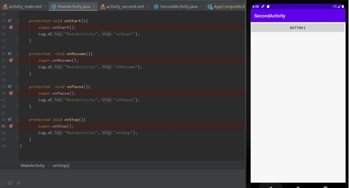

Debug ‘app’

先执行MainActivity的onCreate()函数

 

按F9 执行MainActivity的onStart()函数

 

 

 

 

 

 

 

 

 

 

 

按F9，执行MainActivity的onResume()函数

 

按F9，出现BUTTON 1 按钮

 

 

 

 

 

 

 

 

 

 

 

 

点击BUTTON 1 按钮，执行MainActivity的onPause()函数

 

按F9执行SecondActivity的onCreate()函数

 

按F9执行SecondActivity的onStart()函数

 

按F9执行SecondActivity的onResume()函数

 

按F9 执行MainActivity的onStop()函数

 

 

 

 

 

 

 

 

 

 

 

 

 

按F9进入SecondActivity的界面，出现BUTTON 2按钮

