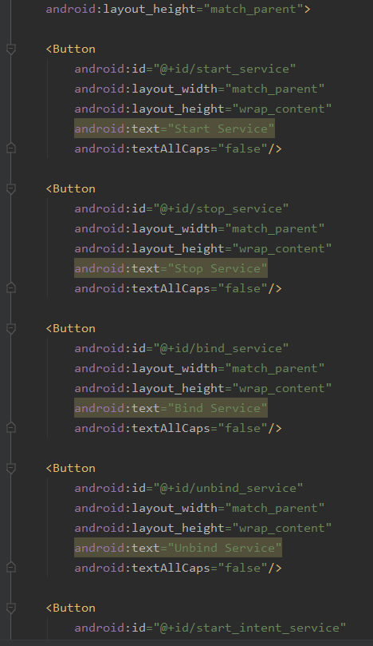
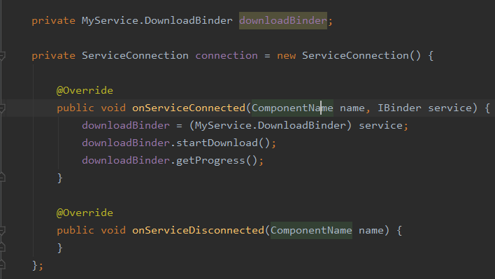
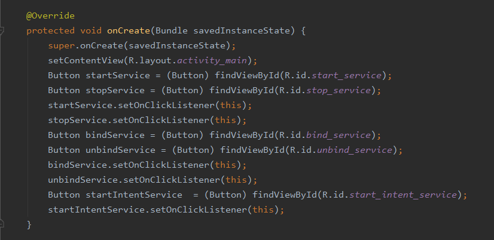
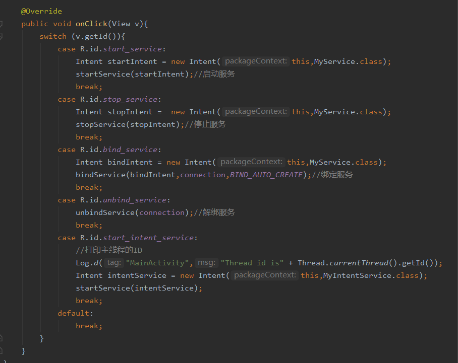
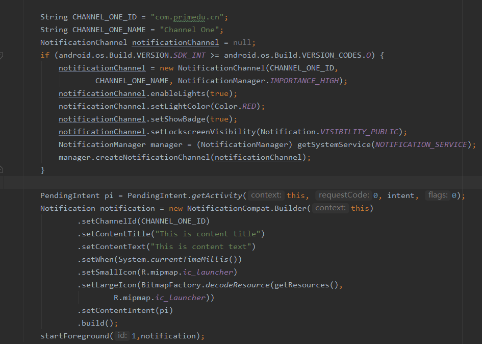
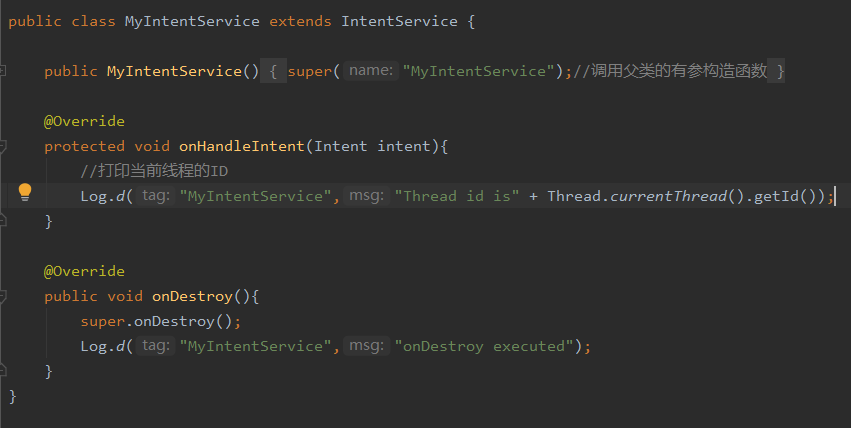
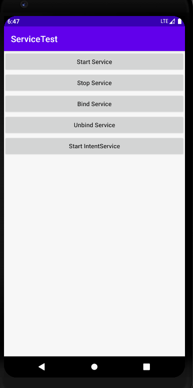
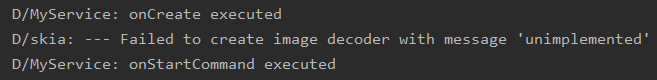
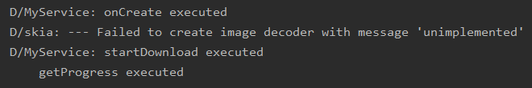
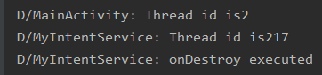

实验十：启动和停止服务，服务代码运行在显示子线程

layout布局

MainActivity

MyService的前台服务

创建MyIntentService类打印子线程ID

实验结果

主界面

点击Start Service 按钮

点击Stop Service 按钮

点击Bind Service 按钮

点击unBind Service 按钮

点击Start intentService 按钮

