 

| 姓名：黄佳桐                                        | 专业： 软件工程      | 班级：20181181 | 学号：2018118133 |
| --------------------------------------------------- | -------------------- | -------------- | ---------------- |
| 科目： Android 第一行代码                           | 实验日期：2020.12.10 |                |                  |
| 实验题目： 子服务的绑定，子服务代码运行在在异步任务 |                      |                |                  |

**实验内容：**

1.添加项目所需的依赖

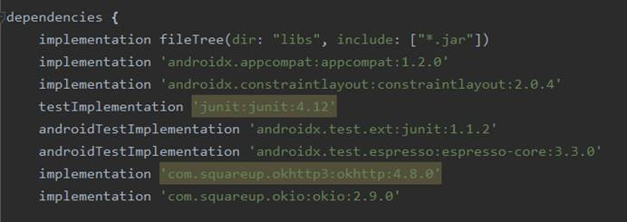

2.新建一个DownloadListener接口

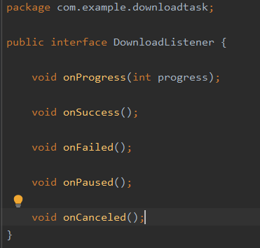

3.新建一个DownloadTask继承AsyncTask

3.1四个常量表示下载状态

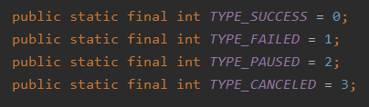

3.2使用doInBackground()在子线程中执行下载任务，判断下载状态

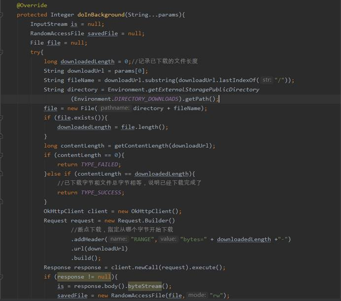

3.3使用onProgressUpdate()方法获取下载进度

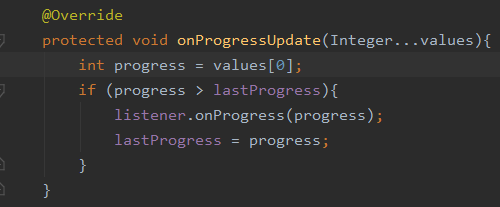

3.4使用onPostExecute()方法根据返回的下载状态进行回调

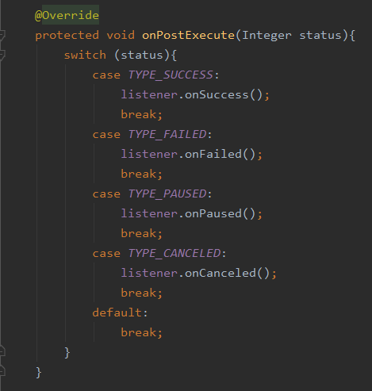

3.5使用getContentLength()方法获取下载文件的总长度，然后返回代表下载状态的常量

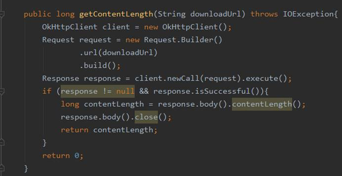

4新建一个下载服务DownloadService，保证Download可以一直在后台运行

4.1创建一个DownloadListener的匿名类实例，实现以下五个方法

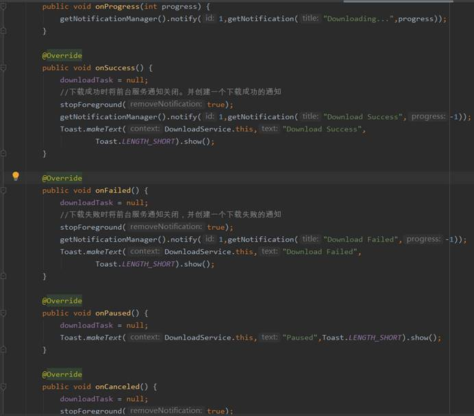

4.2创建一个DownloadBinder提供一下三个方法

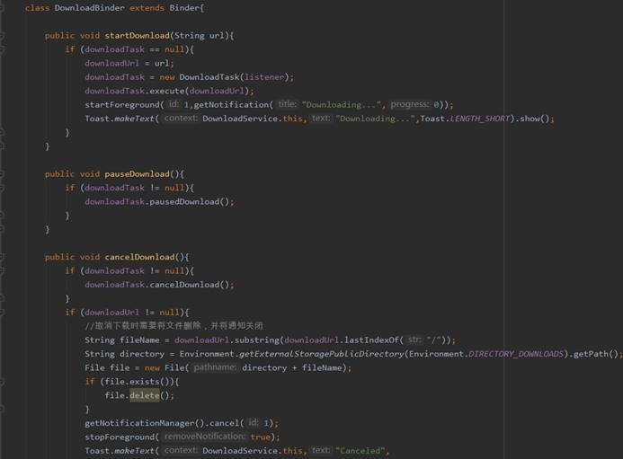

5.activity_main.xml

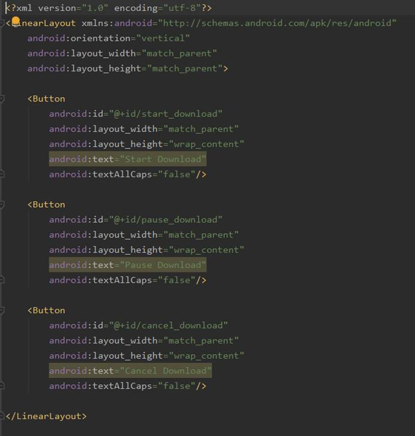

6.MainActivity.java

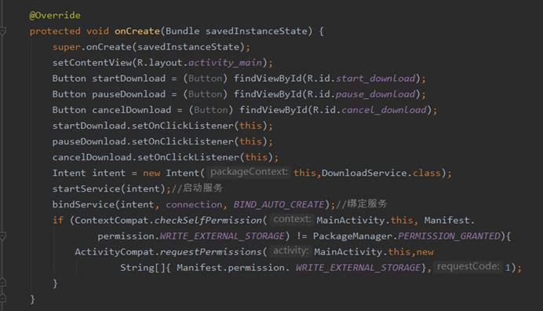

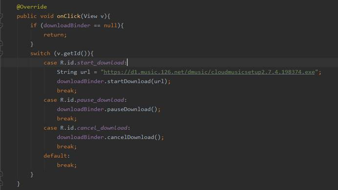

**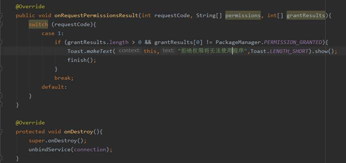**

**实验结果：**

主界面

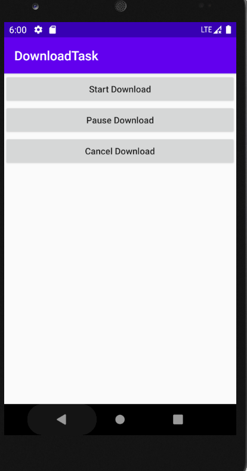

点击 Start Download按钮，然后点击Stop Download 按钮暂停下载

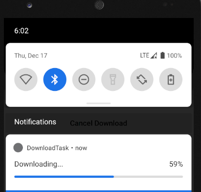

下载完成

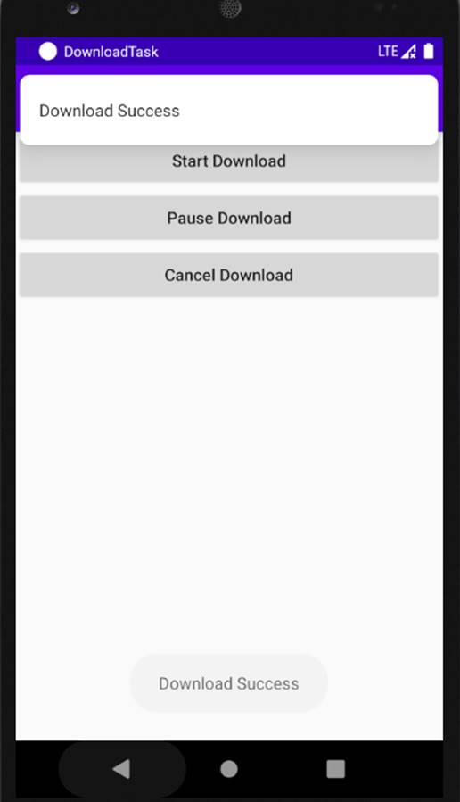