| 姓名：黄佳桐                                 | 专业： 软件工程      | 班级：20181181 | 学号：2018118133 |
| -------------------------------------------- | -------------------- | -------------- | ---------------- |
| 科目： Android 第一行代码                    | 实验日期：2020.12.15 |                |                  |
| 实验题目： 最佳的UI体验——Material Design实战 |                      |                |                  |

**实验内容：**

设置界面的主题颜色，res/values/styles.xml

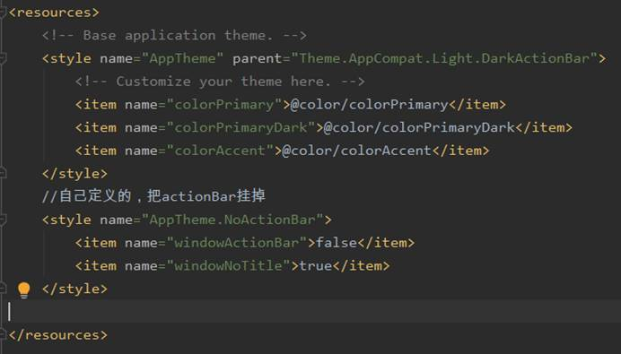

修改activity_main.xml文件的代码，使用Toolbar代替ActionBar

修改MainActivity.java中的代码，通过findViewById()得到Toolbar的实例，然后调用setSupportActionBar()方法并将Toolbar的实例传入

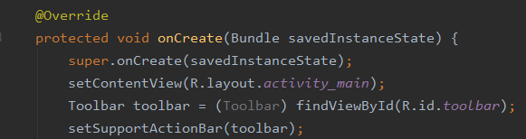

修改标题栏上显示的文字内容

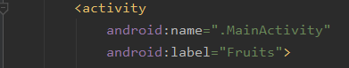

Res目录下新建menu文件夹，在其中创建一个toolbar.xml文件

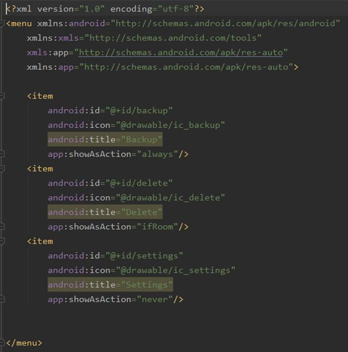

修改MainActivity.jJava中的代码，指定按钮的位置

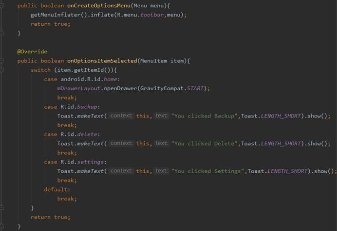

修改activity_main.xml文件的代码，添加DrawerLayout布局

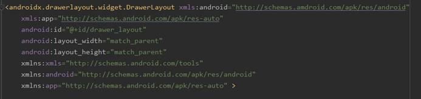

修改MainActivity.jJava中的代码，添加滑动菜单的导航按钮

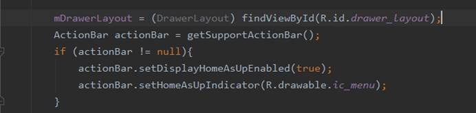

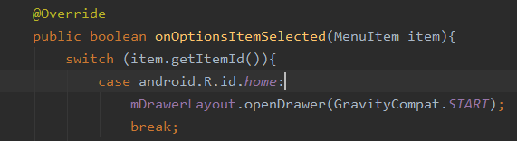

在menu文件夹中创建nav_menu.xml文件设置滑动菜单的功能选项

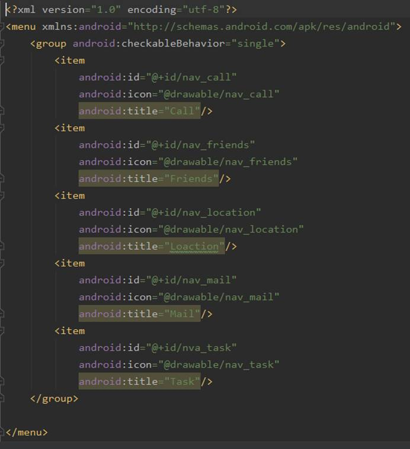

在layout文件夹中新建一个nav_header.xml文件，设置headerLayout

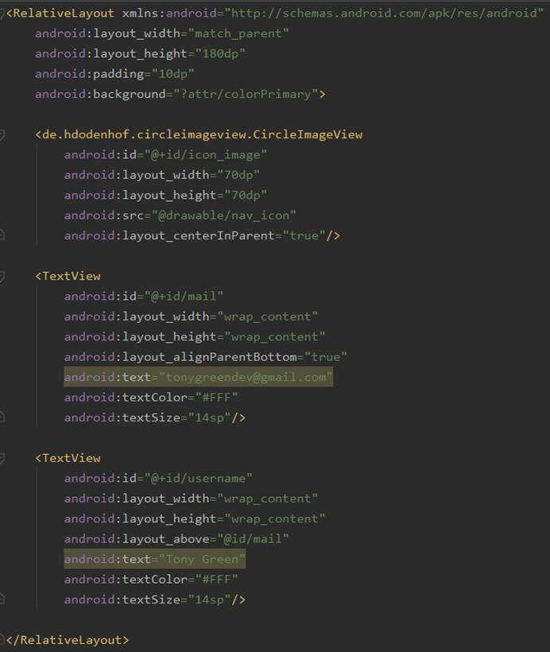

修改activity_main.xml文件，使用NavigationView

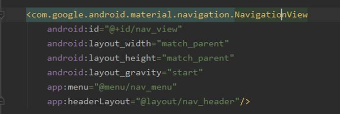

修改MainActivity.java的代码，设置NavigationView的点击事件

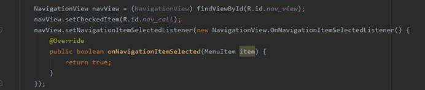

修改activity_main.xml文件，设置悬浮按钮

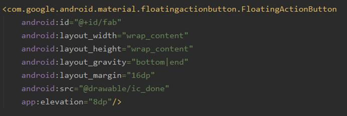

修改MainActivity.java的代码，设置悬浮按钮的点击事件，并使用Snackbar

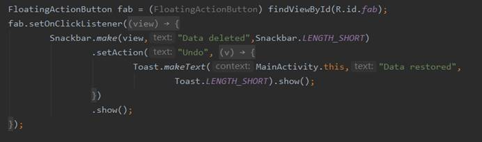

使用CardView添加依赖

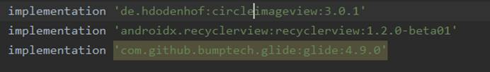

修改activity_main.xml文件，添加RecyclerView

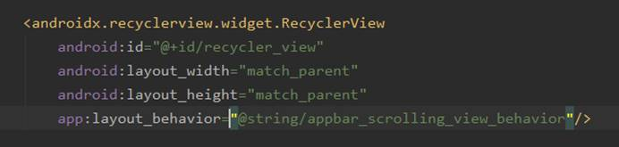

新建一个Fruit类

在layout文件夹中新建一个fruit_item.xml文件

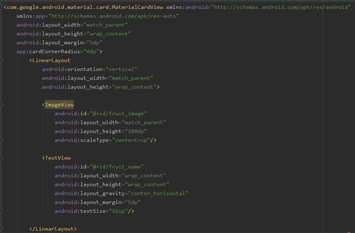

新建FruitAdapter类

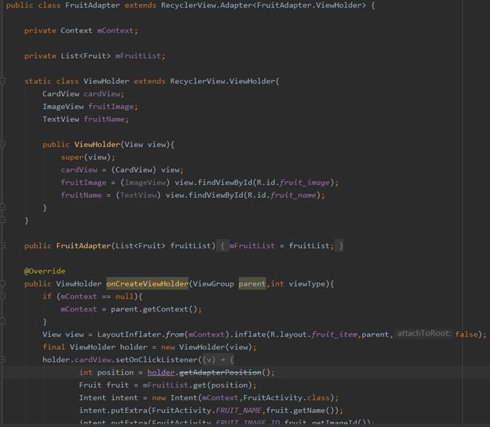

修改MainActivity.java中的代码

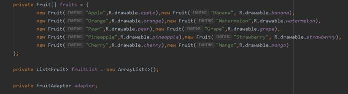

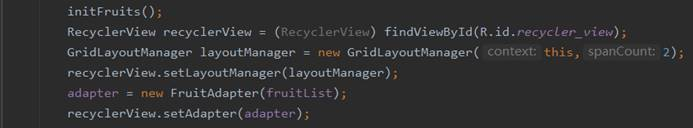

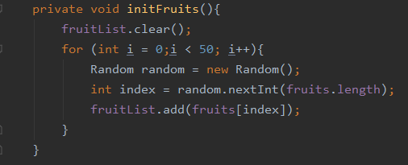

修改activity_main.xml 中的代码，使用AppBarLayout

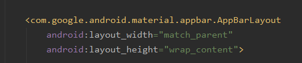

修改activity_main.xml 中的代码,使用SwipeRefreshLayout

修改MainActivity.java中的代码

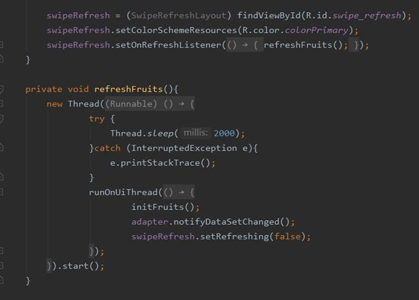

创建一个FruitActivity

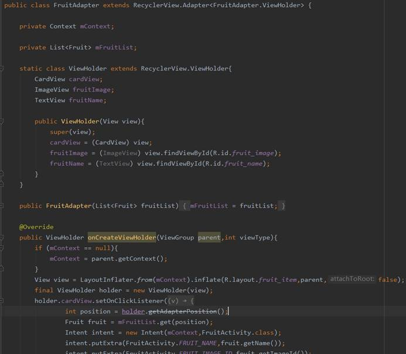

在activity_fruit.xml添加CoordiantorLayout,其中嵌套一个AppBarLayout，在嵌套一个CollasingToolbarLayout

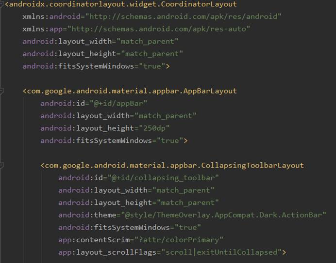

在CollasingToolbarLayout中定义标题栏中的具体内容

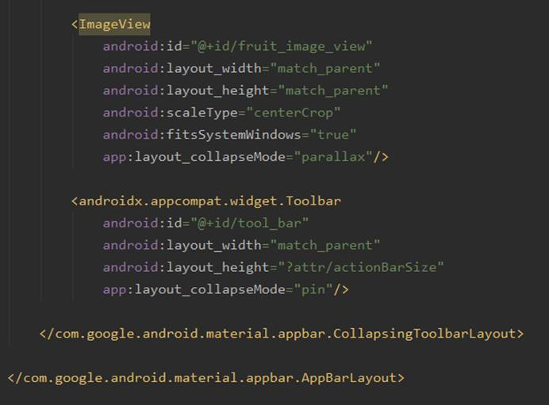

使用NestedScrollView，嵌套CardView显示水果详情，与AppBarLayout平级

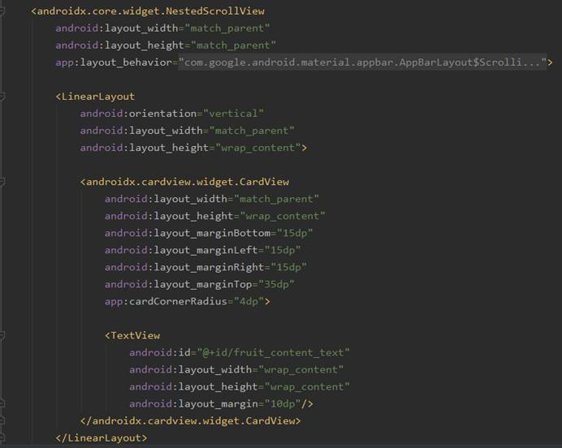

设置一个悬浮按钮

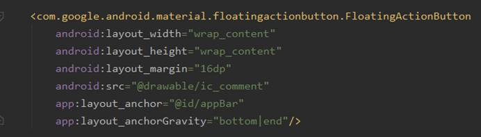

修改FruitAdapter中的代码，处理RecyclerView的点击事件

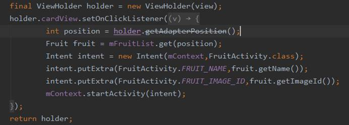

**实验结果：**

主界面

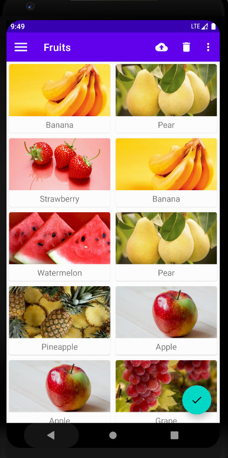

滑动菜单

点击图片或文字

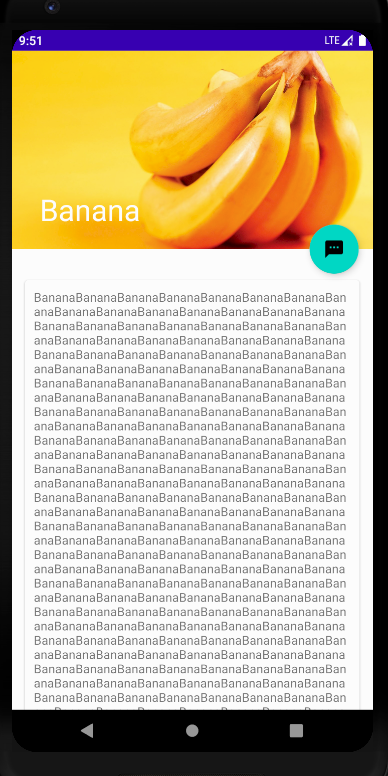

折叠式标题栏

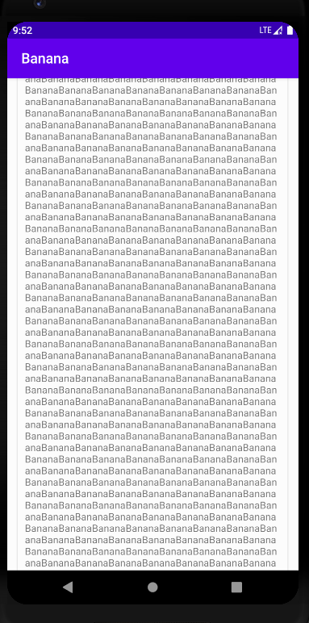

下拉刷新

