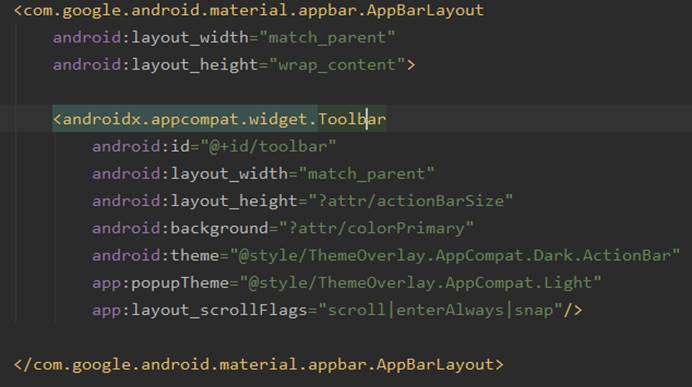
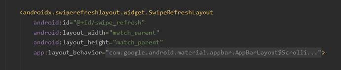
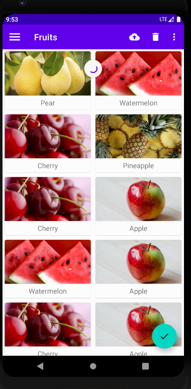

| 姓名：黄佳桐                                 | 专业： 软件工程      | 班级：20181181 | 学号：2018118133 |
| -------------------------------------------- | -------------------- | -------------- | ---------------- |
| 科目： Android 第一行代码                    | 实验日期：2020.12.15 |                |                  |
| 实验题目： 最佳的UI体验——Material Design实战 |                      |                |                  |

**实验内容：**

设置界面的主题颜色，res/values/styles.xml

修改activity_main.xml文件的代码，使用Toolbar代替ActionBar

修改MainActivity.java中的代码，通过findViewById()得到Toolbar的实例，然后调用setSupportActionBar()方法并将Toolbar的实例传入

修改标题栏上显示的文字内容

Res目录下新建menu文件夹，在其中创建一个toolbar.xml文件

修改MainActivity.jJava中的代码，指定按钮的位置

修改activity_main.xml文件的代码，添加DrawerLayout布局

修改MainActivity.jJava中的代码，添加滑动菜单的导航按钮

在menu文件夹中创建nav_menu.xml文件设置滑动菜单的功能选项

在layout文件夹中新建一个nav_header.xml文件，设置headerLayout

修改activity_main.xml文件，使用NavigationView

修改MainActivity.java的代码，设置NavigationView的点击事件

修改activity_main.xml文件，设置悬浮按钮

修改MainActivity.java的代码，设置悬浮按钮的点击事件，并使用Snackbar

使用CardView添加依赖

修改activity_main.xml文件，添加RecyclerView

新建一个Fruit类

在layout文件夹中新建一个fruit_item.xml文件

新建FruitAdapter类

修改MainActivity.java中的代码

修改activity_main.xml 中的代码，使用AppBarLayout

修改activity_main.xml 中的代码,使用SwipeRefreshLayout

修改MainActivity.java中的代码

创建一个FruitActivity

在activity_fruit.xml添加CoordiantorLayout,其中嵌套一个AppBarLayout，在嵌套一个CollasingToolbarLayout

在CollasingToolbarLayout中定义标题栏中的具体内容

使用NestedScrollView，嵌套CardView显示水果详情，与AppBarLayout平级

设置一个悬浮按钮

修改FruitAdapter中的代码，处理RecyclerView的点击事件

**实验结果：**

主界面

滑动菜单

点击图片或文字

折叠式标题栏

下拉刷新

