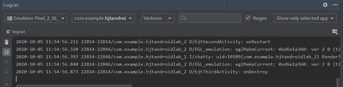

实验二：活动的四种启动模式

一：MainActivity的启动模式是standard

二：hjtFirstActivity的启动模式是singleTop

三：hjtSecondActivity的启动模式是singleTask

四：hjtFourthActivity的启动模式是singInstance

 

1.启动程序，进入MainActivity（standard）

连续点击两次BUTTON按钮

  

连续按3次back键，退出程序

  

2.点击BUTTON 1 进入hjtFirstActivity（singleTop）

此时无论点击多少次BUTTON 1按钮，只需要点击一次back键就可返回MainActivity

 

\3. 点击BUTTON 2 进入hjtSecondActivity（singleTask）

点击BUTTON 3进入hjtThirdActivity,然后在点击BUTTON 2回到hjtSecondActivity

 

此时logcat的打印信息如下：

hjtSecondActivity的onRestart()和hjtThirdActivity的onDestroy()都得到执行

\4. 在MainActivity界面点击BUTTON 3 进入hjtThirdActivity

点击BUTTON 4进入hjtFourthActivity（singInstance）

点击BUTTON 5进入hjtFifthActivity,再点击一次back键，直接返回hjtThirdActivity

 

 

分析与讨论：

\1.   standard是活动的默认启动模式，按点击一次BUTTON按钮，都会创建一个新的MainActivity实例，在返回栈中也增加一个新的实例。

\2.   启动模式为singleTop的活动，在启动活动时如果该活动处于栈顶位置，则可以直接使用（故无论点击多少次BUTTON 1按钮，只需要点击一次back键就可返回MainActivity），否则将创建新的活动实例。

\3.   当活动的启动模式为singleTask时，每次启动该活动系统首先会在返回栈中检查是否存在该活动的实例，如果存在，则直接使用该活动的实例，并且将在该活动之上的所有活动统统出栈，如果栈中没有该活动的实例，则会创建一个新的实例。

\4.   singleInstance模式的活动会启用一个新的单独的返回栈来管理这个活动，不管哪个程序来访问这个活动，都共用一个返回栈。

 