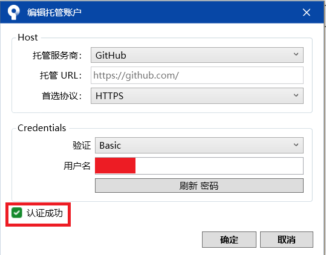
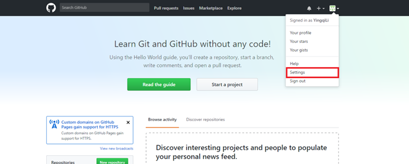
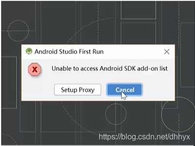

**获取Git安装程序**

  到Git官网下载，网站地址：https://git-scm.com/downloads，如下图：
  

**Git****安装过程** 

**01****、使用许可声明**

 

**02****、选择安装路径**

 

**03****、选择安装组件**

**04****、选择开始菜单页**

 

**05****、选择Git文件默认的编辑器**

**06****、调整您的PATH环境**

 

**07****、选择HTTPS后端传输**

 

**08****、配置行尾符号转换**

 

**09****、配置终端模拟器以与Git Bash一起使用**

**10****、配置配置额外的选项**

**11****、配置实验选项**

 

**12****、安装进度指示**

 

**13****、安装完成**

**14****、启动测试** 

  Git Bash，是Git配套的一个控制台，点击打开如下图：
 

  Git CMD(Deprecated)，是通过CMD使用Git（不推荐使用），点击打开如下图：
 

  Git GUI，是Git的可视化操作工具，点击打开如下图：
  

sourcetree的免注册安装过程

​    首先，下载windows版本的sourceTree。直接进入官网https://www.sourcetreeapp.com/下载

 

进入下载保存sourceTree的目录，双击SourceTreeSetup-2.5.5.exe文件进行安装，可能会弹出如下界面：

 

不用担心，这里选择否，对以后的使用不会有影响的。点击“否”进入下一个页面

点击“下一步”会出现账户注册的页面，也就是下面这个页面。

安装完git之后就会进入sourcetree的页面，也就是说sourcetree的安装成功了。

sourcetree与github的远程连接过程

 

首先需要在github上注册一个账户。记住用户名和密码。在sourcetree客户端首页点击remote进行github账户的添加

 

会弹出一个账户托管的页面，选择配置如下

用户名即github上注册的用户名，然后点击刷新密码

会出现输入github密码的对话框，输入注册的密码之后会出现一个认证成功的标志，然后点击“确定”

 

 

 然后会看到在sourcetree中我们的账户已经添加成功，在右侧还能看到账户下的已有项目。

接下来是将github账户上的项目下载到本地，那么就需要进行远程账户的连接。我们随便选中一个项目进行下载，右击项目名称，选择“克隆”

若“克隆”按键是灰色的，并且会提示不是有效的git仓库可以进行如下操作进行sourcetree和GitHub的连接。点击工具->创建或导入SSH密钥

点击generate进行密钥的生成，在生成密钥过程中将鼠标放在空白处加速密钥的生成

输入Key oassphrase 即自定义的一个密码，在confirm passphrase再次输入刚刚的密码，注意不是github的账号密码。然后点击save private key，保存为id_rsa.ppk格式的文件，记住自己保存文件的路径。一会儿github上进行远程连接的时候会用到。

接下来登录github账户,点击账户名下的settings

选择SSH and GPG keys

点击“new SSH key”

然后输入title ，例如linksourcetree , 在Key那里将刚刚生成的id_rsa.ppk文件中的内容复制到key文本框中，然后点击Add SSH key

然后sourcetree生成的密钥就与github进行远程连接了，最后就可以将github中的项目下载到本地中了。

**下载****Android Studio**

\1.  打开官网链接,点击下载Android Studio

\2.   同意相关条约，勾选我已阅读并同意上述条款及条件，点击下载Android Studio适用平台：Windows

\3.   这时我们只要等着它下完就行了

## 安装Android Studio

\1.  双击下载好的android-studio-ide-191.5977832-windows.exe文件，点击Next
 

 

 

 

 

 

 

 

 

勾选上Android virtual Device(虚拟机安装文件，建议勾选),点击Next(下一步)
 

 

 

 

 

 

 

 

 

 

 

 

 

 

 

选择安装路径，如果你C盘空间不充足的话，我还是建议你安装其他路径，然后继续Next(下一步)
 

这个地方我们就不逗留了，点击Install,稍微等一会，它正在安装程序
 
 

好了，这个时候就已经安装完成，继续Next(下一步)，ok这个时候我们的程序就安装完成了，接着下一步点击Finish运行程序吧！
 
 

找不到Android sdk列表，我们这里选择Cancel(退出)

没有找到Android sdk ，我们必须下载这些开发工具包，点击Next(下一步)
 

它已经帮我们勾选了所需的工具包，（建议更换路径））直接Next(下一步)就行
 

点击Finish，让它继续下载吧（稍微等一会，这个下载会久一点）
 
 

ok，下载完成，这是最后一步，点击Finish运行程序吧，可以看到我们安装的是3.5.2的版本

 

HelloWorld程序

