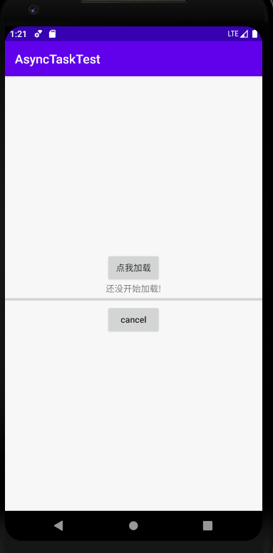

Android实验九

题目：异步任务的隐含子线程程序框架 

 自定义一个AsyncTask任务,命名为Mytask

使用doInBackground(Params...)方法在子线程中执行耗时任务，并返回执行结果

使用onProgressUpdate(Progress...)方法接收后台任务传过来的参数，并更新UI

后台任务执行完成后返回结果，使用onPostExecute(Result)方法接收返回的结果并进行UI操作

实验结果

主界面

点击“点我加载”按钮

更新完成

还没加载完成时点击“cancel”按钮

​    