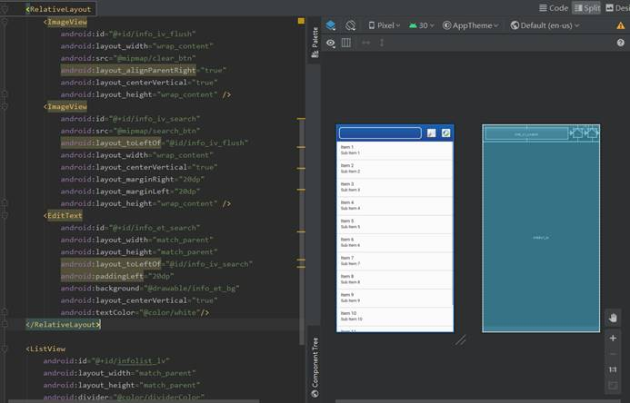
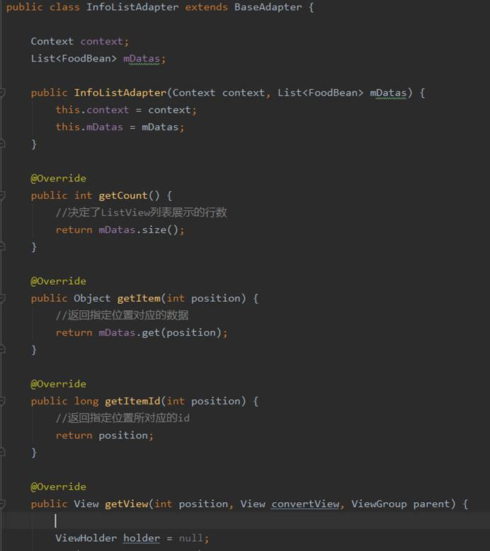
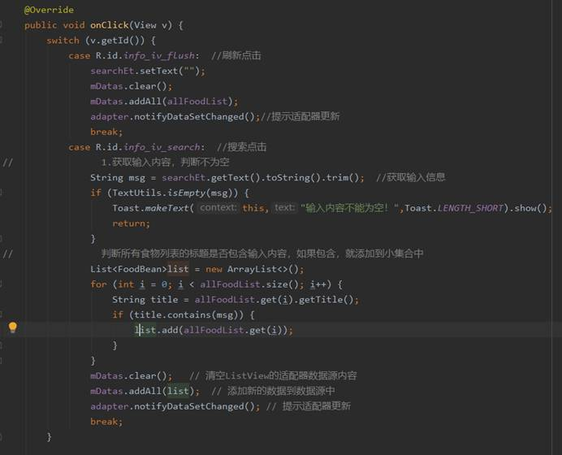

| 姓名：黄佳桐                                 | 专业： 软件工程      | 班级：20181181 | 学号：2018118133 |
| -------------------------------------------- | -------------------- | -------------- | ---------------- |
| 科目： Android 第一行代码                    | 实验日期：2020.12.15 |                |                  |
| 实验题目：  Android课程设计——健康饮食搭配APP |                      |                |                  |

**实验内容：**

右键点击res→New→Directory，创建mipmap文件夹用来存放APP需要用到的图片

创建HomeMenuActivity.java同时创建activity_home_menu.xml文件，修改布局问线性布局，并添加背景图片

修改res→values→styles.xml文件，将DarkActionBar改成NoActionBar

修改activity_home_menu.xml添加三个按钮

修改HomeMenuActivity.java中的代码，判断谁被点击，到这里主界面基本完成

新建活动InfoListActivity,并在layout文件夹中添加activity_info_list.xml文件，修改其中的代码

在drawable文件夹中创建info_et_bg.xml文件，添加图片shape并设置其形状

在values文件夹中的colors.xml文件中添加颜色white和dividerColor的颜色

在layout中新建item_infolist_lv.xml文件，将布局改成相对布局，修改代码添加内容

修改HomMenuActivity中的代码，使用Intent进行页面跳转

新建FoodUtils.java

新建FoodBean.java

新建InfoAdapter.java

将HomeMenuActivity设为主界面

修改InfoListActivity中的代码，添加点击事件

新建一个food_grid包，在其中添加FoodGridActivity活动，修改activity_food_grid.xml中的代码

新建item_foodgrid.xml文件

在drawable中新建item_gridbg.xml设置背景图片

新建FoodGridAdapter

修改FoodGridActivity中的代码

修改HomeMenuActivity中的代码，进行界面的跳转

为了显示第三界面，新建FoodDescActivity和activity_food_desc.xml，修改布局为ScrollView，同时修改代码添加界面详情

修改FoodDescActivity中的代码

修改InofListActivity中的代码，设置第三界面点击跳转监听事件

修改FoodGridActivity中的代码，设置第三界面点击跳转监听事件

新建AboutActivity和activity_about.xml文件，修改布局为线性布局，添加页面详情

新建item_aboutvp.xml文件，设置about页面的图片详情

在AboutActivity中设置分享软件的点击事件

创建AboutAdapter

修改AboutActivity中的代码，实现自动播放下一张图片

创建图片指示器

设置ViewPager页面的监听器

将activity_main.xml改为相对布局

将MainActivity设置为主界面，并倒计时进入HomeMenuActivity界面

修改activity_guide.xml设置引导界面

新建item_guide1.xml，创建引导界面的图片布局

新建包guide放置引导界面的activity，新建GuideAdapter

修改GuideActivity中的代码

修改MainActivity中的代码，判断是不是第一次进入

**实验结果：**

APP图标

主界面，倒计时进入

第一次启动APP进入引导界面

  

点击立即进入，不是第一次开启则不会进入引导界面

点击食物搭配表，出现一个列表视图

在搜索框中输入搜索内容，点击搜索按钮，显示搜索内容，点击刷新按钮，回到食物列表

在食物列表中点击食物，出现第三级界面食物详情

返回点击食物营养表，出现网格视图

点击食物，同样出现第三级界面食物详情

返回点击关于本软件，上面的图片会自动循环切换，也可以手动滑动切换

点击分享软件

